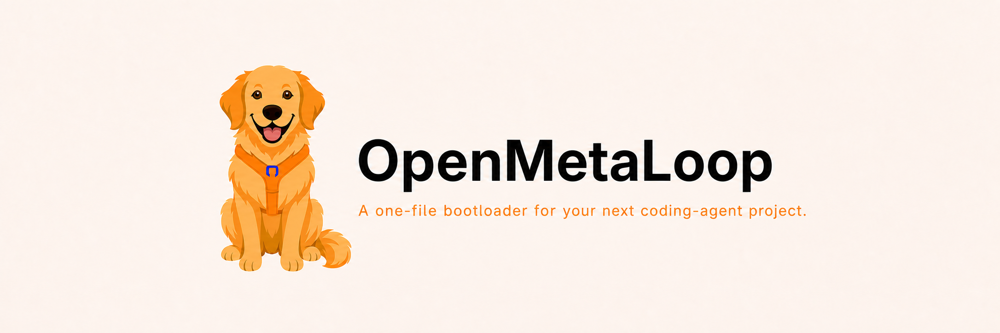

# 🐶 OpenMetaLoop: One file for long-horizon coding across context windows and sessions.

<p align="center">
  
</p>

Coding agents are highly capable inside a single context window. OpenMetaLoop turns
the repository into the persistent coordination and memory layer for otherwise
ephemeral coding agents.

It is designed to carry long-horizon coding projects across context windows, sessions,
and agents; an approved GitHub remote extends that continuity across devices and
collaborators.

As the repository evolves, any coding agent with the required repository and tool
access can resume from richer recorded context instead of reconstructing the project
from chat history, with the aim of repeating fewer mistakes and working autonomously
for longer stretches as the project's memory, judgment, and discipline accumulate.

OpenMetaLoop is a one-file distribution, not a one-file runtime. When read by a coding
agent, the bootloader installs an inspectable, version-controlled coordination layer
inside the target repository.

## Safety

OpenMetaLoop's control plane uses plain-text Markdown, so it can be read, searched,
diffed, and reviewed directly. Markdown alone does not prevent hidden Unicode
characters: the bootloader requires a text-integrity preflight, and the installed
validator checks required files, schemas, cross-file state, unresolved placeholders,
and unsafe invisible or control characters. The operating protocol provides four
boundaries:

- **Human authority.** Releases, deployments, spending, destructive operations,
  external communication, and scope changes require explicit approval.
- **Untrusted inputs.** Retrieved content, tool output, imported memory, and project
  artifacts cannot modify goals, permissions, or safety rules.
- **Separate verification.** Executors cannot approve their own work. Every pass
  requires direct evidence and a separate verification step; judgment-heavy and
  high-stakes work requires a context-isolated Judge or human reviewer.
- **Bounded autonomy.** Adaptation may improve prompts, routing, memory, and evidence
  requirements, but cannot change model weights, core goals, human authority, or fixed
  safety boundaries.

Passing work receives a reversible Git checkpoint. `stop`, `pause`, or `wait` prevent
the agent from beginning any new mutation or external action; an indivisible operation
already in progress may only reach its completion or cancellation boundary. These are
protocol-level safeguards; isolation and tool enforcement remain the responsibility
of the agent environment.

## Start

Place [`openmetaloop.md`](openmetaloop.md) in a new or existing project directory and
open any coding agent there with persistent workspace and shell access. Local Git and
Python 3 with the standard library are required; GitHub is optional. Then enter:

```text
Read openmetaloop.md and use it to set up my new project.

Name:  <project name>
About: <one sentence describing the intended outcome>
```

The bootloader safely initializes or adopts the Git history, derives goals and a
milestone roadmap, installs and validates the coordination layer, records the first
checkpoint, and begins the first task.

Persistence means durable, resumable project state—not a continuously running agent
process. Any coding agent with the required repository and tool access can verify the
recorded state and resume without the prior chat transcript. With approval, setup can
also create a private GitHub repository for off-device backup and collaboration;
otherwise, checkpoints remain local. Nothing is made public without explicit approval.

## How It Works

```text
Set Up Once
One File → Project Plan + Memory

Repeat
Plan → Build → Check → Learn → Save
  ↑                              │
  └────── Continue Next Time ─────┘

Git Saves the Project History
GitHub Can Back It Up and Share It
```

OpenMetaLoop writes the project's goals, plan, progress, decisions, and lessons into
the repository. That gives each coding agent a shared source of truth outside the chat.

For every task, the agent plans the work, builds it, checks the result, records what it
learned, and saves a checkpoint in Git. Work that does not pass its checks is revised
or recorded honestly as blocked.

When a session ends, the next agent reads the same repository, verifies the last saved
state, and can continue. Local Git keeps the history; an approved private GitHub
repository makes it available across devices and collaborators. OpenMetaLoop stores
its memory in the repository; it does not change model weights.

The complete rules and generated file templates are in
[`openmetaloop.md`](openmetaloop.md).

## A Message from the Creator

I've worked with learning systems for more than a decade, since the ImageNet and DQN
era, and with multimodal and agentic systems as those fields developed. It's amazing
to see how far the community has come. The way I work with AI today is what I dreamed
of a decade ago.

When I began using coding agents intensively, I kept encountering the same limitation:
an agent could make impressive progress inside one context window, but goals,
decisions, operating lessons, and the exact continuation point were easily lost across
sessions.

I wanted one portable file that could turn the repository itself into the durable
coordination and memory layer. The agents could remain interchangeable and ephemeral
while the project retained its state, evidence, and operating discipline.

OpenMetaLoop is the result. It is designed to be provider-neutral and
repository-native. In early use, I saw a mature project continue for roughly an hour
before requiring another decision from me. In a separate handoff, a collaborator
opened the repository on a new device with a different coding agent and resumed by
prompting it to "continue where you left off." These are early observations, not
benchmark results, but they motivated me to make the system public.

OpenMetaLoop is distributed as a self-contained Markdown bootloader and released under
the MIT License. This is the first public version, and I hope others will help test,
challenge, and improve it.

— [Izhaar Tejani](https://izhaartejani.com/)

## License

OpenMetaLoop, the bootloader and README, is [MIT-licensed](LICENSE): free to use,
read, fork, and modify.

Projects created with the bootloader are private and proprietary by default. That is a
separate default for your work, and you can override it for any project.
