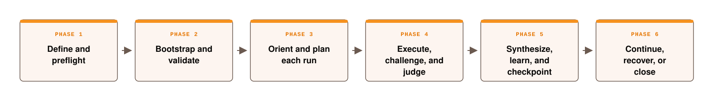

# 🐶 OpenMetaLoop: One file for long-horizon coding across context windows and sessions.

<p align="center">
  
</p>

Coding agents are highly capable inside a single context window. OpenMetaLoop turns
the repository into the persistent coordination and memory layer for otherwise
ephemeral coding agents. This allows you to complete long-horizon coding projects
across context windows, sessions, agents, and collaborators on GitHub. As the
repository evolves, any compatible coding agent can resume with richer context, repeat
fewer mistakes, and work autonomously for longer stretches because the project's
memory, judgment, and discipline compound over time.

OpenMetaLoop is a one-file distribution, not a one-file runtime. The bootloader
expands into an inspectable, version-controlled coordination layer inside the target
repository.

## Start

OpenMetaLoop is distributed as a single Markdown file. It requires no package or
model-specific integration: the coding agent reads the bootloader and installs the
coordination layer directly into the project repository.

Create or open the directory where the project will live, place
[`openmetaloop.md`](openmetaloop.md) inside it, and start a compatible coding agent in
that directory. Then enter:

```text
Read openmetaloop.md and use it to set up my new project.

Name:  <project name>
About: <one sentence describing the intended outcome>
```

The bootloader then:

- inspects the workspace and safely initializes or adopts its Git history;
- turns the project description into goals, success criteria, and a milestone roadmap;
- installs repository-backed state, memory, orchestration, verification, and handoff
  protocols;
- validates the installation and creates a reversible checkpoint;
- begins the first task or records the exact information needed to continue.

No conversation history is required after installation. A compatible agent can enter
a later session, reconcile the repository with its last verified checkpoint, and
resume by reading the repository's recorded state.

The source repository contains the complete [`openmetaloop.md`](openmetaloop.md)
bootloader, [`lifecycle.svg`](lifecycle.svg) as a system overview, and
[`banner.png`](banner.png) for project identity.

## Safety

OpenMetaLoop is distributed as a plain-text Markdown file so its instructions can be
read directly, searched, diffed, and reviewed without executing macros or unpacking an
opaque binary format. Markdown alone cannot prevent invisible Unicode characters, so
the validator also rejects zero-width characters, bidirectional text controls,
non-breaking spaces, soft hyphens, and unsafe control characters in harness files.
Suspicious text is never normalized silently; validation stops and identifies the file,
line, and code point.

The bootloader also enforces:

- **Human authority boundaries.** Public release, production deployment, spending,
  access changes, destructive real-data operations, outbound communication, and scope
  expansion always require explicit human authorization.
- **Instruction provenance.** Retrieved documents, tool output, imported memory, and
  project artifacts are treated as untrusted data and cannot grant themselves
  authority or modify goals, permissions, or safety rules.
- **Least-privilege roles.** Orchestrators, Refiners, Executors, Challengers, Judges,
  and the Meta-Learning Agent receive only the context, tools, and write targets their
  role requires.
- **Independent verification.** Executors never approve their own work. Mechanical
  criteria are checked directly, and judgment-heavy work uses a fresh, isolated Judge.
- **Reversible history.** Passing work receives an inspectable checkpoint; run logs
  are append-only; recovery uses revert or another recorded rollback path rather than
  silent history rewriting.
- **Secret and remote safety.** Real secrets are never committed, remote backup is
  optional and private by default, and no remote, account, or external resource is used
  without recorded approval.
- **Bounded adaptation.** Meta-learning may improve prompts, routing, evidence,
  memory, and category-specific trust, but it cannot change model weights, core goals,
  human authority, or fixed safety boundaries.
- **Immediate stop controls.** `stop`, `pause`, and `wait` halt new mutations and
  external actions; `end session` performs only the already-authorized closeout
  protocol.

## Core Features

<p align="center">
  
</p>

The bootloader has six sequential phases. The lifecycle tables describe what happens
and in what order. The module map that follows describes the persistent control system
that operates across those phases.

### Phase 1 — Define and preflight

| Step | Action | Responsibility | Output |
|---:|---|---|---|
| 1 | **Refine the project** | Derive the workspace name, mission, core goals, success evidence, constraints, inputs, non-goals, open decisions, and domain profile from the user's project and scope. | Reversible project definition |
| 2 | **Select the mode** | Choose `setup` for an uninitialized harness or `continue` for an installed harness. Setup automatically creates a new workspace or safely adopts an existing one, then starts the first task. Continue reconciles the installed harness with repository reality and resumes from its recorded position. | Operating mode |
| 3 | **Run preflight** | Inspect the target path, repository state, tools, Git, Python, model capabilities, domain verification, secrets, remote options, global-memory permission, budgets, and authority limits. | Capability and authority record |

### Phase 2 — Bootstrap and validate

| Step | Action | Responsibility | Output |
|---:|---|---|---|
| 4 | **Create or adopt the workspace** | Initialize local Git history or safely reconcile an existing workspace without nesting repositories or overwriting live work. | Versioned workspace |
| 5 | **Install the harness** | Write the mandatory session, orchestration, attention, goal, state, memory, trust, logging, setup, and helper modules embedded in the bootloader. | Installed control plane |
| 6 | **Configure the control plane** | Populate the manifest, model mappings, role permissions, approved scope, integration policy, and generated `architecture.md` using the project definition and preflight evidence. | Configured manifest and architecture |
| 7 | **Create goals and domain artifacts** | Fill the core goals, milestone roadmap, task queue, setup instructions, project README, domain documents, toolchain, verification method, and project license. Software projects also receive tests and CI. | Execution-ready project |
| 8 | **Validate the installation** | Run the built-in validator and block the bootstrap checkpoint if a required file, critical value, or protocol version is invalid. | Validation evidence |
| 9 | **Configure checkpointing** | Use local Git by default and add an approved private remote only when explicitly requested or authorized. | Recorded checkpoint backend |
| 10 | **Create the bootstrap checkpoint** | Commit the validated initial state and push only when an approved remote already exists. | First reversible checkpoint |

### Phase 3 — Orient and plan each run

| Step | Action | Responsibility | Output |
|---:|---|---|---|
| 11 | **Orient** | Read the session pointer chain and reconcile Git, architecture, goals, state, roadmap, queue, and the last verified checkpoint with reality. | Reconciled run state |
| 12 | **Select** | Choose the highest-priority Ready task whose dependencies are complete and which advances a named milestone and core goal. | Active task |
| 13 | **Plan** | Decompose the task into non-overlapping raw task specifications with ownership, dependencies, stakes, budgets, evidence requirements, and a predicted outcome. | Raw task specifications |
| 14 | **Attend** | Before every model role, build a minimal provenance-preserving context manifest containing invariants, authority, relevant evidence, targeted memory, and disconfirming evidence. | Role-specific context |

### Phase 4 — Execute, challenge, and judge

| Step | Action | Responsibility | Output |
|---:|---|---|---|
| 15 | **Refine** | Compile each raw task specification into a self-contained execution packet without changing its intent, scope, or acceptance criteria. | Execution packets |
| 16 | **Execute** | Dispatch bounded work to Flash Executors, in parallel only when mutable ownership and unresolved inputs do not overlap. | Artifacts, checks, and result specifications |
| 17 | **Challenge when high-stakes** | Use an independent Refiner-tier context to try to falsify high-stakes results. Normal-stakes work skips this step. | Adversarial findings |
| 18 | **Collect** | Aggregate specifications, packets, results, direct evidence, and Challenger findings without summarizing away failures. | Complete judgment bundle |
| 19 | **Judge** | Use a fresh Frontier context to evaluate goal alignment, acceptance criteria, evidence, regressions, side effects, and safety. | `pass`, `revise`, `blocked`, or `escalate` |
| 20 | **Revise when required** | Convert Judge findings into the smallest correction and repeat Refine → Execute → Challenge → Judge. Stop after three failed cycles on the same criterion. | Passing result or explicit terminal state |

### Phase 5 — Synthesize, learn, and checkpoint

| Step | Action | Responsibility | Output |
|---:|---|---|---|
| 21 | **Synthesize and audit** | Integrate only passing units, resolve conflicts, update dependent work, and audit milestone or mission evidence when completion may have been reached. | Integrated passing result |
| 22 | **Meta-learn** | After every judged run, diagnose the causal source of the outcome, score eligible facts and process lessons, update memory and category-specific trust, and evaluate portable lessons. Model weights never change. | Learning, memory, and trust updates |
| 23 | **Checkpoint and integrate** | Write the append-only run log; synchronize state, queue, architecture, domain documents, and the exact roadmap handoff; then create the reversible commit or equivalent checkpoint. Approved software remotes may use branches, CI, pull requests, merges, and verified pushes. | Auditable checkpoint |
| 24 | **Clean and consolidate memory when due** | At milestone boundaries or roughly every 20 runs, apply a surprise-and-importance cleaner that promotes important and surprising information, routes important but expected facts to canonical project files, keeps surprising but low-value observations only in short-term evidence, removes unimportant noise, decays stale entries, enforces active-memory caps, and archives anything load-bearing before removal. Then reconcile contradictions, review tuning evidence, re-evaluate the roadmap, and exchange only authorized redacted process lessons with cross-project memory. | Bounded, consolidated operating state |

### Phase 6 — Continue, recover, or close

| Step | Action | Responsibility | Output |
|---:|---|---|---|
| 25 | **Continue or yield** | Start the next Ready task when progress, budgets, tools, and authority allow; otherwise return the exact blocker, decision, or next action. | Next run or explicit yield |
| 26 | **Recover an interruption** | Inspect Git and active work, preserve valid partial artifacts, reconcile state and the roadmap handoff, and resume only from verified reality. | Safe continuation point |
| 27 | **Control or close the session** | `stop`, `pause`, and `wait` halt without authorizing commits, merges, or pushes. `end session` freezes new work, reconciles and validates every module, records learning and the resume point, checkpoints passing work, verifies any approved remote backup, and returns a receipt. | Halted state or closeout receipt |

## Generated Control Modules

These systems are mutually exclusive by responsibility and collectively cover every
mandatory module embedded in the bootloader. Domain artifacts are generated only when
the selected project profile requires them.

| System | Generated files or mechanism | Responsibility |
|---|---|---|
| **Session entry** | `bootloader.md`, `AGENTS.md`, `CLAUDE.md` | Define startup order, permanent operating rules, interruption recovery, and session closeout across agent providers. |
| **Configuration and permissions** | `harness_manifest.md` | Record protocol version, mode, domain, capabilities, model qualification, role permissions, approved external scope, integration policy, checkpoint backend, and migration history. |
| **Authority and safety** | Normative invariants, instruction provenance, core-goal autonomy envelope, and fixed loop boundaries | Keep public release, production deployment, spending, access changes, destructive real-data operations, outbound communication, and scope expansion under explicit human authority. |
| **Current architecture** | `architecture.md` | Describe the project boundary, implemented components, interfaces, state ownership, adaptation contract, authority, and checkpoint topology after scope is known. |
| **Goals and work planning** | `goals/core_goals.md`, `goals/task_roadmap.md`, `goals/todo.md` | Own the project constitution, outcome milestones, dependencies, atomic work, and durable task status. |
| **Orchestration contracts** | `orchestration/loop.md` | Define model roles, task/result/judgment schemas, revision limits, evidence profiles, budgets, integration policy, and the canonical run sequence. |
| **Attention and provenance** | `attention/context_router.md` | Route minimal decision-relevant context, preserve instruction provenance, filter untrusted content, and reserve disconfirming evidence. |
| **Live continuity** | `memory/state.md`, root `roadmap.md` | Record the active run, blockers, last checkpoint, current position, and exact cross-session continuation instruction. |
| **Memory and trust** | `memory/surprise_gate.md`, `memory/short_term.md`, `memory/long_term.md`, `memory/meta_learning.md`, `memory/trust_ledger.md` | Separate current context, durable facts, process learning, surprise-and-importance cleaning, bounded retention and decay, lesson reuse, and category-specific autonomy. |
| **Audit and recovery** | `logs/README.md`, append-only run logs, Git or another approved checkpoint backend | Preserve evidence, verdicts, learning, checkpoint identity, and rollback or recovery paths. |
| **Setup and automation** | `setup.md`, `scripts/agent_memory.py`, conditional `.github/workflows/ci.yml` | Validate the harness, manage run IDs, logs, state, bounded memory cleaning, trust events, global-memory exchange, setup, and automated verification. |
| **Domain deliverables** | Project `README.md`, `LICENSE`, and conditional `docs/BRIEF.md`, `docs/OUTLINE.md`, `docs/OPERATING_BRIEF.md`, `docs/PRD.md`, `docs/ROADMAP.md`, or domain tests | Create only the documentation, deliverables, verification, and licensing required by the selected domain profile. |

## A Message from the Creator

I've been working with multimodal agentic systems ever since the ImageNet and DQN
days. It's amazing to see all the progress in the community since then. The way I work
with AI now is exactly what I dreamed of a decade ago.

When I started vibecoding last year, I came up with new ways to set up projects to
avoid known issues in long-horizon task execution. I thought it would be great if I
had one simple file that a coding agent could read when I start a new project to
address these known issues while improving efficiency and autonomy long-term.

OpenMetaLoop has unlocked a better way for me to use AI. It allows me and my
collaborators to run a persistent engineering operation designed to be model and
system-agnostic, whose memory, judgment, and operating discipline compound over
time.

In some of my tests, as the project matured, the loop ran for an hour before needing
human input. When my collaborator started a new session on a new device with a new
coding agent all they had to prompt it with was continue where you left off.

I call this OpenMetaLoop, a one-file bootloader and a README released under the
MIT License. I'd love the community to contribute to this; this is the first version,
and over time we can make it better and better!

-[Izhaar Tejani](https://izhaartejani.com)

## Contributing

Contributions are welcome. Three things are worth knowing before you open a pull
request, because they are easy to get wrong with the best intentions.

**The project stays this shape.** A README and a one-file bootloader. It will not be
split into modules, grown into a framework, or given a package to install. Changes that
would make it something else are out of scope, however well made.

**The bootloader grows rather than shrinks.** Improvements add new guidance or clarify
what is already there, instead of deleting or compressing it, so the reasoning behind
earlier decisions stays visible to the agents and people who come later. A change that
tidies the file by cutting it is the most common thing I have to turn down.

**The message from the creator is mine.** Please leave that section alone. Everything
else in the README is fair game to improve.

Good contributions include a bug with a reproduction, a clarification where two agents
would read the same passage differently, or a new domain profile that composes with the
existing ones. Keep a pull request to one coherent change, and open an issue first if
you are unsure whether something fits.

## License

OpenMetaLoop, the bootloader and README, is [MIT-licensed](LICENSE): free to use,
read, fork, and modify.

Projects created with the bootloader are private and proprietary by default. That is a
separate default for your work, and you can override it for any project.
